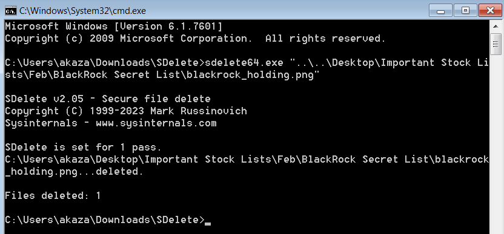

# Stock Syndrome

by aseng

---

## Flag

```
LKS{s3cret_sToCk_k3pt_by_BlackRocks!}
```

## Description

Akaza is a new broker in securities company who has a good management risk in trading. Although some says that he's known to have an acquintance from the company's competitor called BlackRock, and doing pump & dump , so that's how he leverage a strategy to go on profit. This is not a good strategy and a violation for the market.

Few days ago, the company told the staff that there'll be a very detailed annual checking on their device to make sure no cheating or any manipulation activity exists. The ongoing check is done by the police and digital forensicator but they notice Akaza has deleted a mysterious file from his laptop. This can be shown from the **CMD** picture below. Additional note is that every staff's OS is still **Windows 7** with **default setting** (Vanilla).

Every artifact is a proof for the forensicator but it's sad knowing `sdelete64.exe` is a secure eraser tool to delete a file from **disk**, an act of anti-forensic. The forensicator made a disk image dump so that you could perform a disk image forensic to recover the file, no matter how. This is a very impossible task but we know that you're clever enough to tell an alternative artifact that can still expose the BlackRock holding statement which is removed by him.

Notes: They have tried `photorec`, `binwalk`, `foremost`, and other recovery tool but they don't get any proof / successfully recover it directly.



Disk Image attachment can be downloaded here -> https://binusianorg-my.sharepoint.com/personal/felix_alexander_binus_ac_id/_layouts/15/guestaccess.aspx?share=EdSY9pPq1FtEg-5NKXF_SPABp-swD8AHmQhwmTyjnIAWZQ&e=rpoJpe 

Real Disk Size: 4.9GB

Attachment Zip Password : `LKS24_p4$$word_but_n0t_gu3$$sable_lol_1hsjjkdjiodklslmsdlkm`

## Difficulty
medium-hard

## Hints
* Hint 1: Pay attention to the chronology description of the challenge, the artifact is depending on it.
* Hint 2: Anti Forensic is implemented but the guy doesn't know if it still exists and stored in **the same form**

## Tags
`disk-image`, `anti-forensic`, `thumbnail`